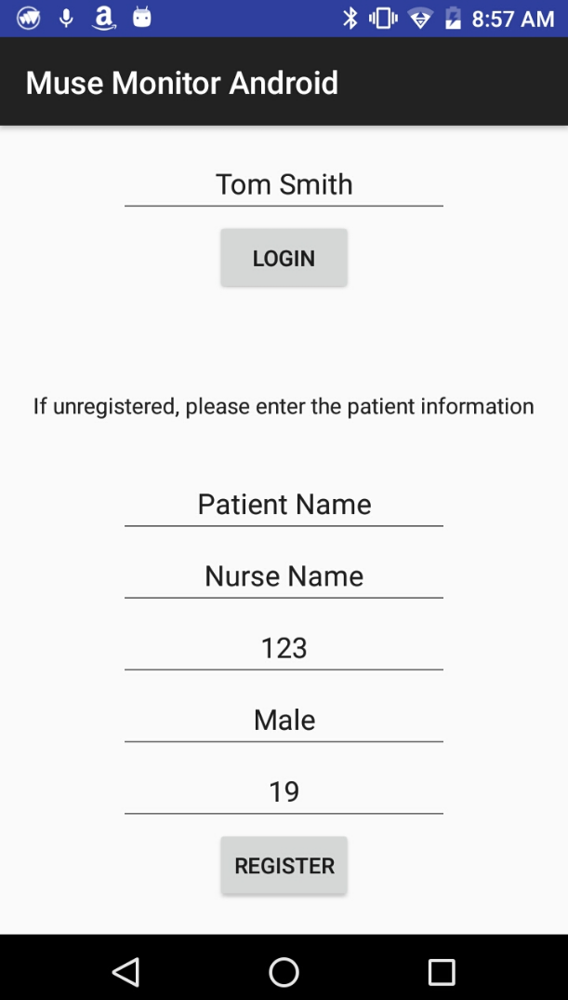
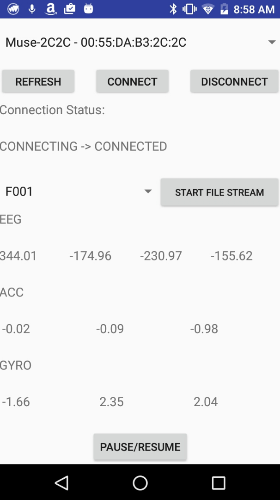
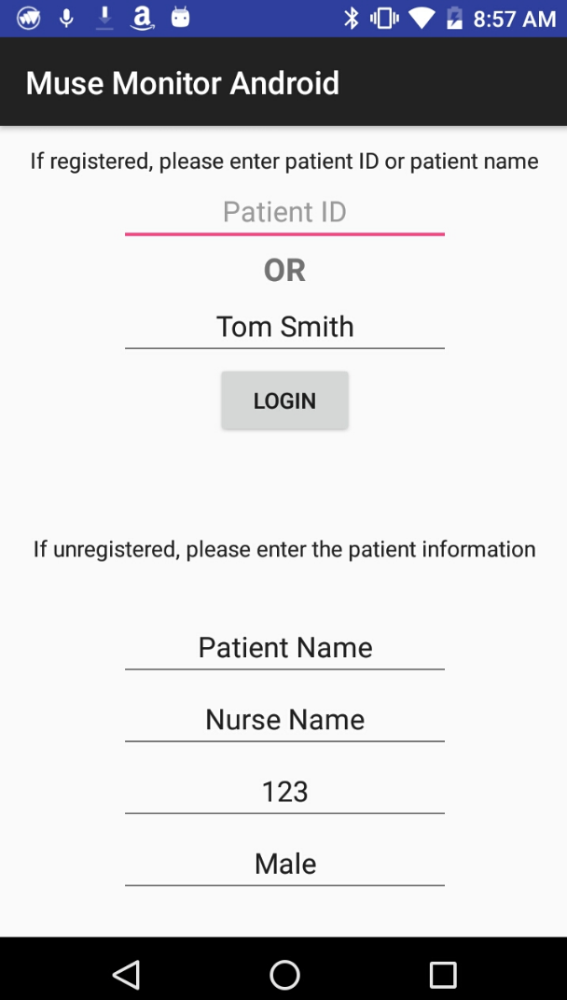
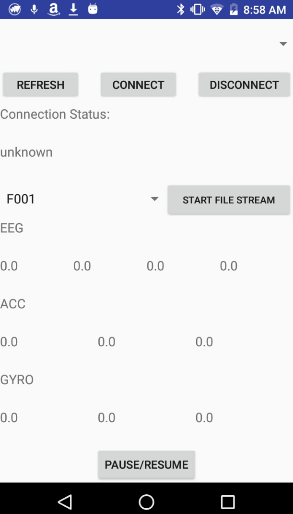
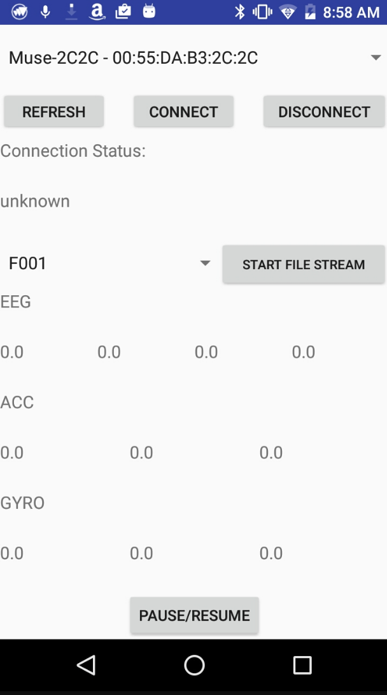
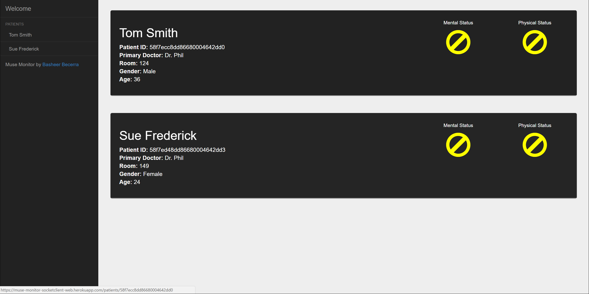
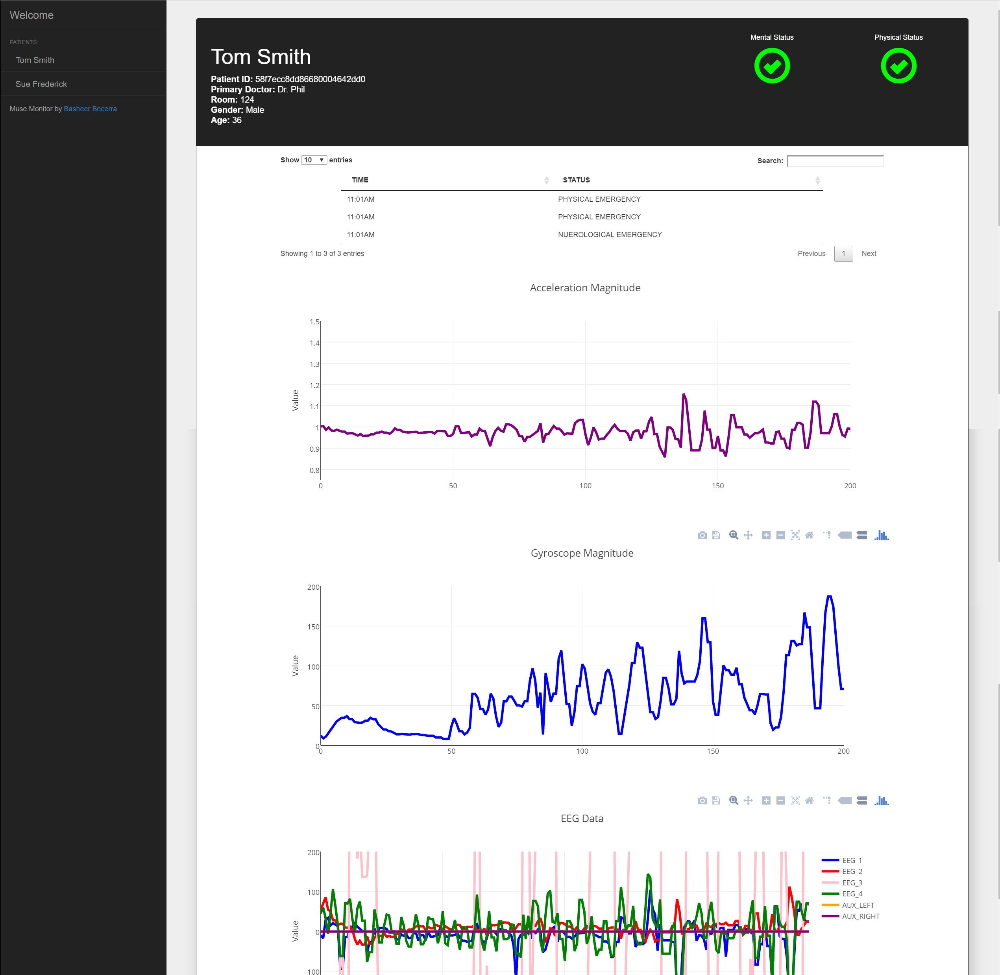

# User manual

## Connecting the Patient

### Register Patient
To register the patient, open the Android application. Scroll to the bottom of the initial screen and enter the patient information:  
  

If successful, the page should change to the data stream page:  

 
## Patient Sign In
If the patient is already registered, enter the patient ID or the patient name in the fields above:  

 

If successful, the page should change to the data stream page:  

 

### Stream Data
In the data stream page, turn on the Muse Headband. You will see the device name appear on the top dropdown. If the device name
does not automatically appear, press the "Refresh" button.  

 

Press the connect button once the device name appears. The data should automatically stream.  
 

### View Patient Data
Open up the web client (linked [here](https://muse-monitor-socketclient-web.herokuapp.com/patients)). You will see a list of all registered
patients:  

 

To view the data of a specific patient, click on the patient name. The details screen should appear:  

 

You will now recieve all alerts and notifications for the given patient.
